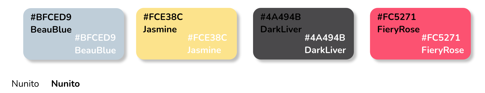
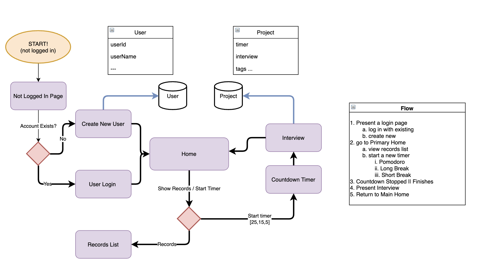
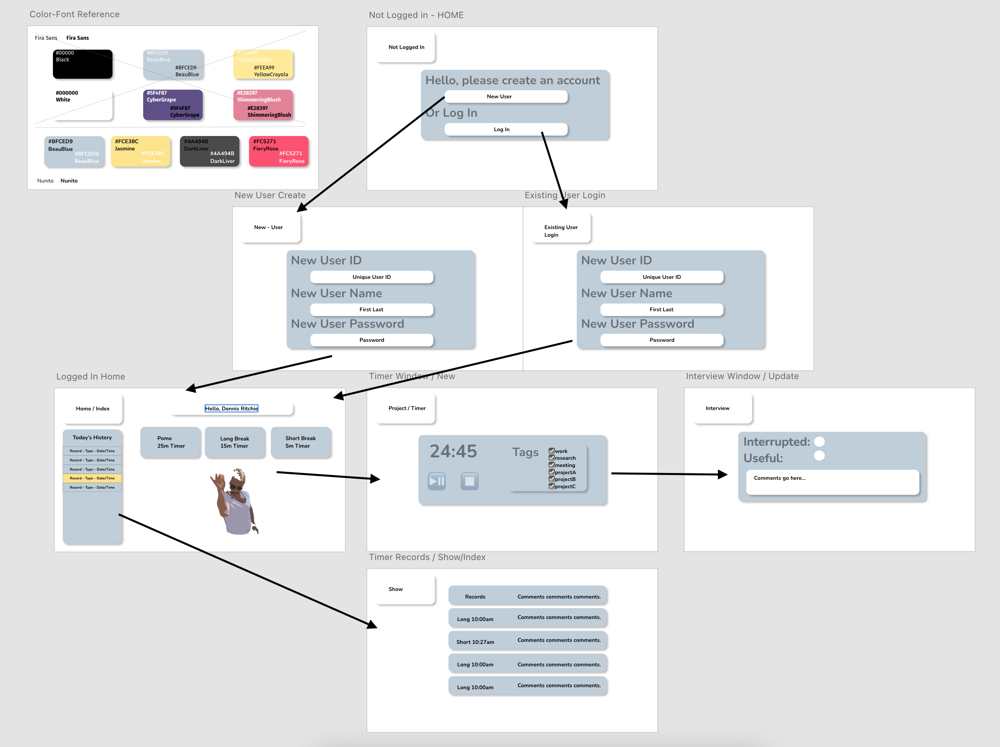

# Framework and Styling

## Styling
More details on stylesheet construction to be included on a new page.

We settled on Nunito as our font with the following colors we thought were pleasant and easy to read.

## Framework Planning
The general flow, as described in the [user story page](user-story.md) should adhere to the following. Some pages may be merged if possible with the combined page serving the same purpose.

## Wireframe Planning

Our initial wireframe planning with general page layout and a generic design goal for each view page. Our goal is very quick to read with bold text and bright colors. A matching floating card style with rounded edges and drop shadows should help guide users between elements as needed. 

